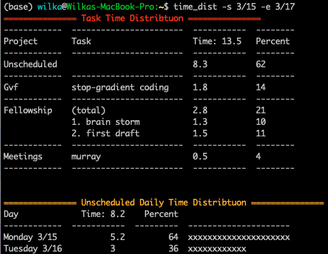
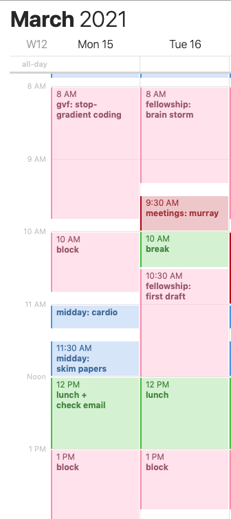

## Example Usage

I assume calendar events follow the format: `project:task`.

```bash
time_dist --start 3/15 --end 3/17
```

Here's an example from my calendar with dummy data:
<table>
  <tr>
    <td>
      
    </td>
    <td>
      
    </td>
  </tr>
  <tr>
    <td>Example terminal call</td>
    <td>Corresponding calendar</td>
  </tr>
</table>


## Getting Started

Step 1: Install.

```bash
pip install -e .
```


Step 2: turn on the Google Calendar API for this app and get credentials (`credentials.json`). You only need to do step 1 from [Google Python Quickstart tutorial](https://developers.google.com/calendar/quickstart/python).


Step 3: create a file called `settings.yaml` and place it in this directory. It should contain the following:

```yaml
credentials: credentials.json # probably unchanged 

# calendars you want to load
calendars:
- "calendar 1"
- "calendar 2"

# name of events that will be used for assigning time
assignable:
- block
- deep-work
```

* `calendars`: The calendars within your gmail account you want to load data from
* `assignable`: The name used for events which you will treat as ''unassigned time". See example below.


## Resources
1. [Google Calendar API](https://developers.google.com/calendar/)
2. [My time-management guide](https://wcarvalho.github.io/tutorial/2016/01/08/TimeManagementPrescription/)
